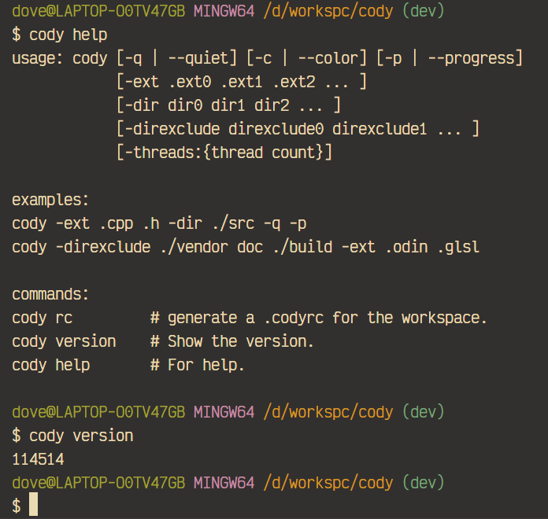

## A simple lines counter

### Introduction
Cody is a lines counter written in [Odin Language](https://odin-lang.org). 
It helps you recursively count lines in the workspace.

`cody help` will show you how to use.

### Todo
- Block comment parsing. 
- Sorted output.
- More comment style. 
- Speed up.
  - Comment parsing.
  - Files filtering.

### .codyrc
You can config some workspace options in a .codyrc file to avoid
typing lots of things every time. Use `cody rc` to generate an example.

`directories`, string array.

`ignore_directories`, string array.

`extensions`, string array.

`quiet`, boolean.

### Example

